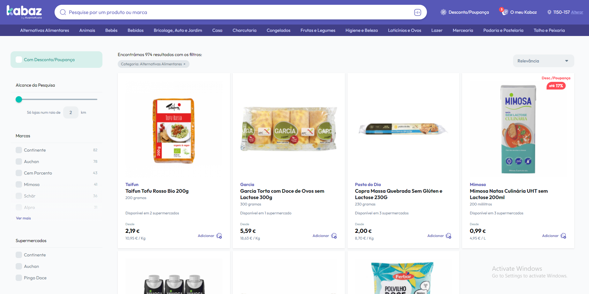

# **Competitor Analysis: Kabaz**  

## **General Information**  
- **Name of System:** Kabaz  
- **Company/Developer:** KuantoKusta  
- **Website/Product Page:** [Kabaz](https://www.kabaz.pt)  
- **Version/Release Date:** *(Not specified)*  
- **Platform(s) Supported:** Web  
- **Target Audience:** Individuals who frequently grocery shop and want to compare prices across different stores.  

---  

## **Core Functionality**  

### **Primary Purpose**  
Kabaz allows users to search for various grocery products and compare their prices across multiple stores. Additionally, it enables users to create and manage grocery lists while providing an overview of price variations.  

### **Key Features**  
- Product search functionality  
- Price comparison across different grocery stores  
- Creation and management of grocery lists  

### **Unique Selling Points (USPs)**  
- Provides a clear and easy-to-understand price comparison for the same product across multiple stores  

### **Limitations/Weaknesses**  
- May struggle with real-time price updates  
- Difficulty handling missing or unavailable product types  

---  

## **Screenshots**  

  
> **Landing Page**  

  
> **Product Search**  

  
> **Grocery List**  

---  

## **Online Reviews**  
No reviews found.  