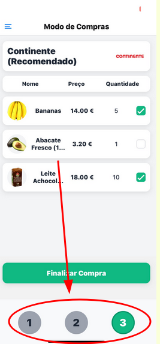

[Back to main Logbook Page](../hci_logbook.md)

---

# F. Discussion of Evaluation Results
- After reviewing tests we add to once again change the way changing screens is done in our app
- The other problems that appeared, were only esporadic and the user quickly understood what he had to do
# Refinement List
- How to change screens
# Refined Prototype
- Not that much changes appart from replacing the arrows with numbers, but now the numbers dont have the > between them to show the user that he can go back and forth

---
[Back to main Logbook Page](../hci_logbook.md)

---